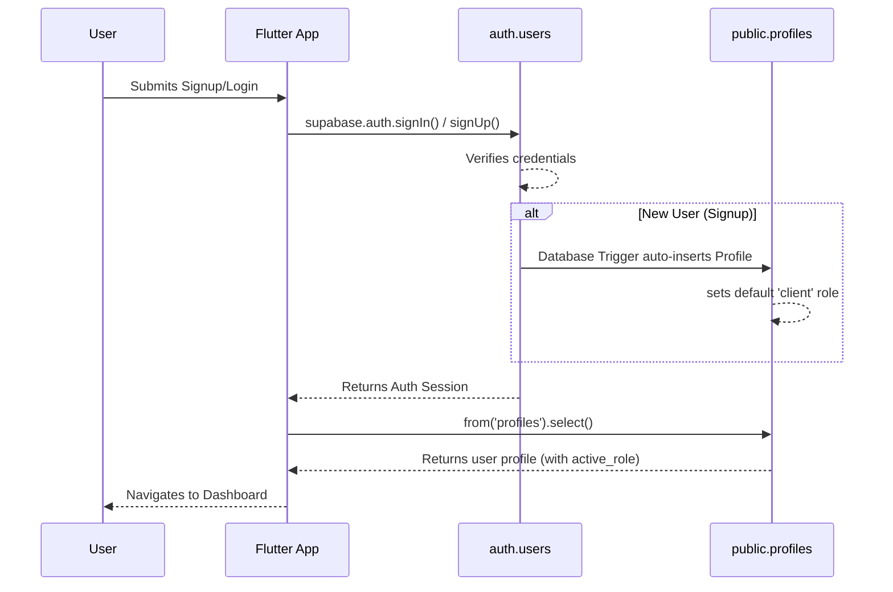

# 05 Original Diagram (V1)

```mermaid
sequenceDiagram
    participant U as User
    participant App as Flutter App
    participant Auth as auth.users
    participant DB as public.profiles

    U->>App: Submits Signup/Login
    App->>Auth: supabase.auth.signIn() / signUp()
    Auth-->>Auth: Verifies credentials

    alt New User (Signup)
        Auth->>DB: Database Trigger auto-inserts Profile
        DB-->>DB: sets default 'client' role
    end

    Auth-->>App: Returns Auth Session
    App->>DB: from('profiles').select()
    DB-->>App: Returns user profile (with active_role)
    App-->>U: Navigates to Dashboard
```
