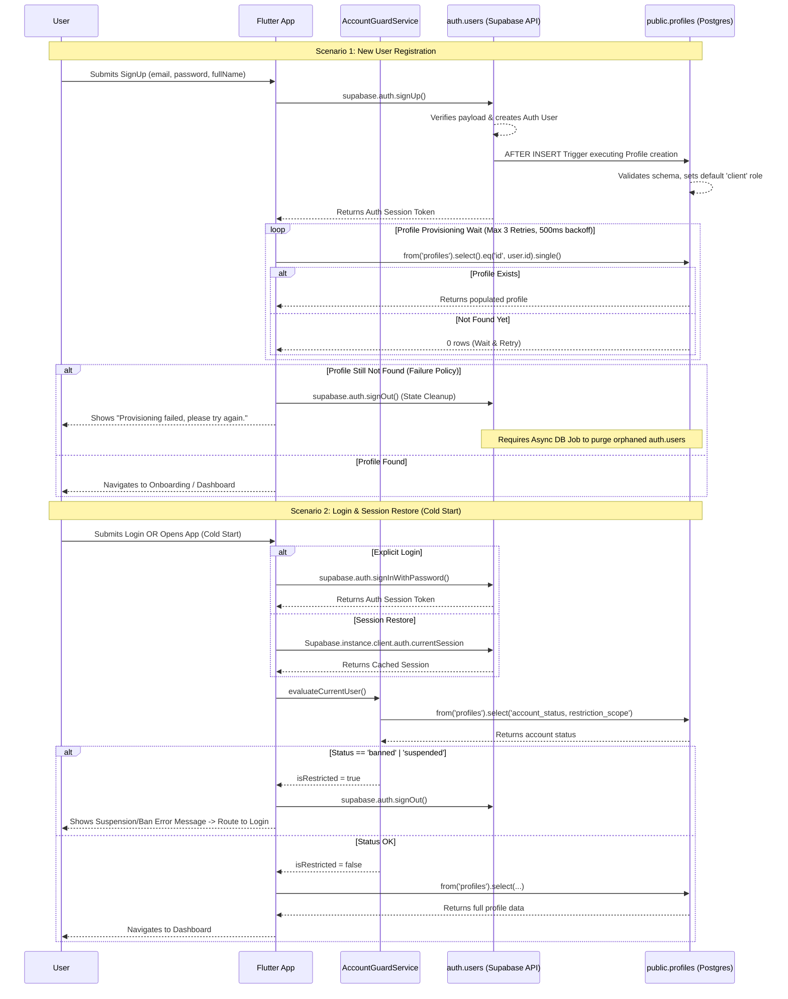

# 06 Final Diagram (Hardened)

```mermaid
sequenceDiagram
    participant U as User
    participant App as Flutter App
    participant Guard as AccountGuardService
    participant Auth as auth.users (Supabase API)
    participant DB as public.profiles (Postgres)

    Note over U, DB: Scenario 1: New User Registration
    U->>App: Submits SignUp (email, password, fullName)
    App->>Auth: supabase.auth.signUp()
    Auth-->>Auth: Verifies payload & creates Auth User

    %% Implicit atomic trigger
    Auth->>DB: AFTER INSERT Trigger executing Profile creation
    DB-->>DB: Validates schema, sets default 'client' role
    Auth-->>App: Returns Auth Session Token

    %% Handle race condition with retry
    loop Profile Provisioning Wait (Max 3 Retries, 500ms backoff)
        App->>DB: from('profiles').select().eq('id', user.id).single()
        alt Profile Exists
            DB-->>App: Returns populated profile
        else Not Found Yet
            DB-->>App: 0 rows (Wait & Retry)
        end
    end

    alt Profile Still Not Found (Failure Policy)
        App->>Auth: supabase.auth.signOut() (State Cleanup)
        App-->>U: Shows "Provisioning failed, please try again."
        Note over DB, Auth: Requires Async DB Job to purge orphaned auth.users
    else Profile Found
        App-->>U: Navigates to Onboarding / Dashboard
    end

    Note over U, DB: Scenario 2: Login & Session Restore (Cold Start)
    U->>App: Submits Login OR Opens App (Cold Start)

    alt Explicit Login
        App->>Auth: supabase.auth.signInWithPassword()
        Auth-->>App: Returns Auth Session Token
    else Session Restore
        App->>Auth: Supabase.instance.client.auth.currentSession
        Auth-->>App: Returns Cached Session
    end

    %% Critical Guard Check for ALL entry paths
    App->>Guard: evaluateCurrentUser()
    Guard->>DB: from('profiles').select('account_status, restriction_scope')
    DB-->>Guard: Returns account status

    alt Status == 'banned' | 'suspended'
        Guard-->>App: isRestricted = true
        App->>Auth: supabase.auth.signOut()
        App-->>U: Shows Suspension/Ban Error Message -> Route to Login
    else Status OK
        Guard-->>App: isRestricted = false
        App->>DB: from('profiles').select(...)
        DB-->>App: Returns full profile data
        App-->>U: Navigates to Dashboard
    end
```
