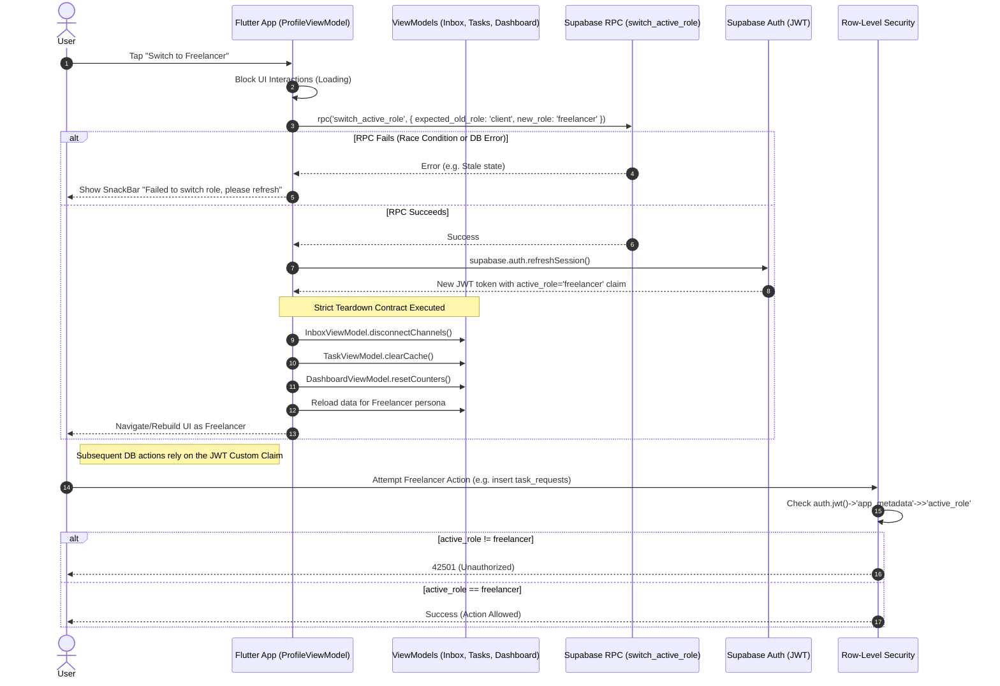

```mermaid
sequenceDiagram
    autonumber
    actor User
    participant App as Flutter App (ProfileViewModel)
    participant Providers as ViewModels (Inbox, Tasks, Dashboard)
    participant SupabaseDB as Supabase RPC (switch_active_role)
    participant Auth as Supabase Auth (JWT)
    participant RLS as Row-Level Security

    User->>App: Tap "Switch to Freelancer"
    App->>App: Block UI Interactions (Loading)

    %% Atomic guard: prevents race conditions from double taps or multi-device
    App->>SupabaseDB: rpc('switch_active_role', { expected_old_role: 'client', new_role: 'freelancer' })

    alt RPC Fails (Race Condition or DB Error)
        SupabaseDB-->>App: Error (e.g. Stale state)
        App-->>User: Show SnackBar "Failed to switch role, please refresh"
    else RPC Succeeds
        SupabaseDB-->>App: Success

        %% Session refresh is a HARD BLOCKER if using JWT claims for RLS
        App->>Auth: supabase.auth.refreshSession()
        Auth-->>App: New JWT token with active_role='freelancer' claim

        %% Exact Teardown Contract
        note over App,Providers: Strict Teardown Contract Executed
        App->>Providers: InboxViewModel.disconnectChannels()
        App->>Providers: TaskViewModel.clearCache()
        App->>Providers: DashboardViewModel.resetCounters()

        App->>Providers: Reload data for Freelancer persona
        App-->>User: Navigate/Rebuild UI as Freelancer
    end

    %% Security Enforcement Context
    note right of User: Subsequent DB actions rely on the JWT Custom Claim

    User->>RLS: Attempt Freelancer Action (e.g. insert task_requests)
    RLS->>RLS: Check auth.jwt()->'app_metadata'->>'active_role'
    alt active_role != freelancer
        RLS-->>User: 42501 (Unauthorized)
    else active_role == freelancer
        RLS-->>User: Success (Action Allowed)
    end
```
