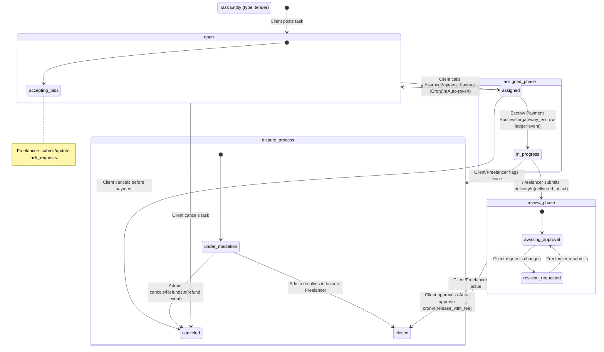

# Improved Mermaid Diagram V2

```mermaid
stateDiagram-v2
    state "Task Entity (type: tender)" as T

    [*] --> open : Client posts task

    state open {
        [*] --> accepting_bids
        note right of accepting_bids
            Freelancers submit/update task_requests.
        end note
    }

    open --> assigned : Client calls accept_task_request\n(Locks offer, unpaid)
    open --> canceled : Client cancels task

    state assigned_phase {
        assigned --> in_progress : Escrow Payment Success\n(gateway_escrow ledger event)
    }

    assigned --> open : Escrow Payment Timeout (Cron)\n(Auto-revert)
    assigned --> canceled : Client cancels before payment

    in_progress --> review_phase : Freelancer submits delivery\n(delivered_at set)

    state review_phase {
        [*] --> awaiting_approval
        awaiting_approval --> revision_requested : Client requests changes
        revision_requested --> awaiting_approval : Freelancer resubmits
    }

    review_phase --> closed : Client approves / Auto-approve cron\n(release_with_fee)

    in_progress --> dispute_process : Client/Freelancer flags issue
    review_phase --> dispute_process : Client/Freelancer flags issue

    state dispute_process {
        [*] --> under_mediation
        under_mediation --> canceled : Admin cancels/Refunds\n(refund event)
        under_mediation --> closed : Admin resolves in favor of Freelancer
    }
```
