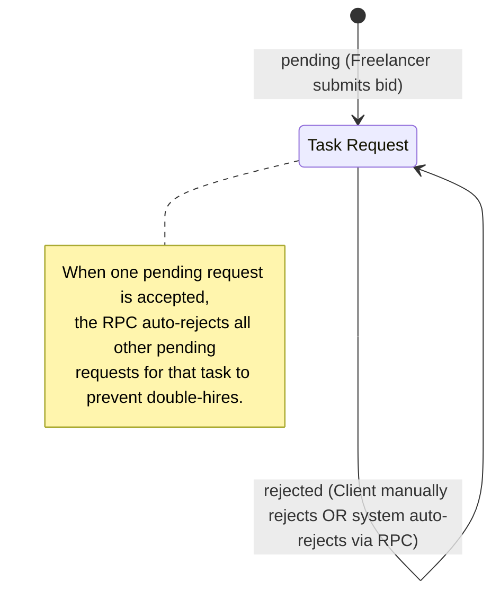

```mermaid
stateDiagram-v2
    state "Task Request" as TR

    [*] --> TR: pending (Freelancer submits bid)
    TR --> TR: accepted (Client runs accept_task_request)
    TR --> TR: rejected (Client manually rejects OR system auto-rejects via RPC)

    note right of TR
      When one pending request is accepted,
      the RPC auto-rejects all other pending
      requests for that task to prevent double-hires.
    end note
```
