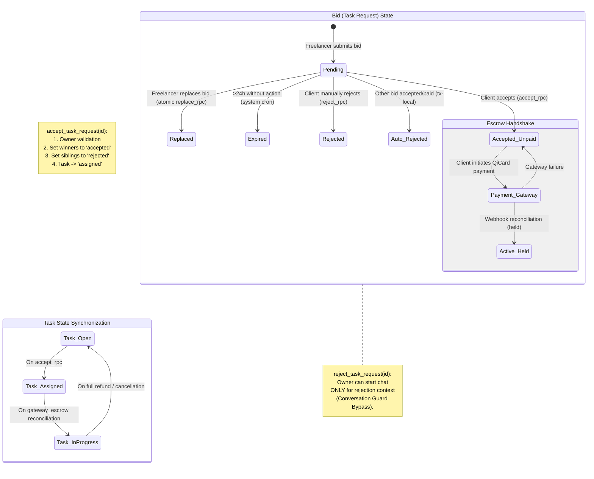

```mermaid
stateDiagram-v2
    %% Bid Flow with Payment Gateways and Auto-Reject Logic

    state "Bid (Task Request) State" as BidLifecycle {
        [*] --> Pending : Freelancer submits bid
        Pending --> Replaced : Freelancer replaces bid (atomic replace_rpc)
        Pending --> Expired : >24h without action (system cron)
        Pending --> Rejected : Client manually rejects (reject_rpc)
        Pending --> Auto_Rejected : Other bid accepted/paid (tx-local)

        Pending --> Accepted_Unpaid : Client accepts (accept_rpc)

        state "Escrow Handshake" as PaymentFlow {
            Accepted_Unpaid --> Payment_Gateway : Client initiates QiCard payment
            Payment_Gateway --> Active_Held : Webhook reconciliation (held)
            Payment_Gateway --> Accepted_Unpaid : Gateway failure
        }
    }

    state "Task State Synchronization" as TaskLifecycle {
        Task_Open --> Task_Assigned : On accept_rpc
        Task_Assigned --> Task_InProgress : On gateway_escrow reconciliation
        Task_InProgress --> Task_Open : On full refund / cancellation
    }

    note right of BidLifecycle
        reject_task_request(id):
        Owner can start chat
        ONLY for rejection context
        (Conversation Guard Bypass).
    end note

    note left of TaskLifecycle
        accept_task_request(id):
        1. Owner validation
        2. Set winners to 'accepted'
        3. Set siblings to 'rejected'
        4. Task -> 'assigned'
    end note
```
