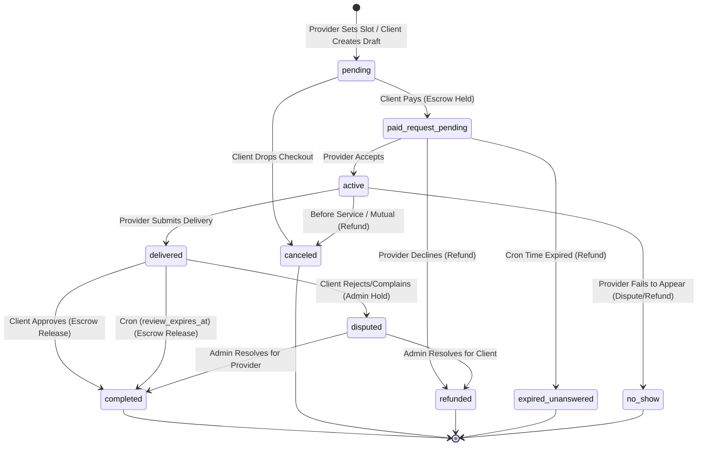

# Final Improved Booking Lifecycle Diagram

```mermaid
stateDiagram-v2
    [*] --> pending: Provider Sets Slot / Client Creates Draft

    pending --> paid_request_pending: Client Pays (Escrow Held)
    pending --> canceled: Client Drops Checkout

    paid_request_pending --> active: Provider Accepts
    paid_request_pending --> refunded: Provider Declines (Refund)
    paid_request_pending --> expired_unanswered: Cron Time Expired (Refund)

    active --> delivered: Provider Submits Delivery
    active --> canceled: Before Service / Mutual (Refund)
    active --> no_show: Provider Fails to Appear (Dispute/Refund)

    delivered --> completed: Client Approves (Escrow Release)
    delivered --> disputed: Client Rejects/Complains (Admin Hold)
    delivered --> completed: Cron (review_expires_at) (Escrow Release)

    disputed --> completed: Admin Resolves for Provider
    disputed --> refunded: Admin Resolves for Client

    completed --> [*]
    canceled --> [*]
    refunded --> [*]
    expired_unanswered --> [*]
    no_show --> [*]
```
