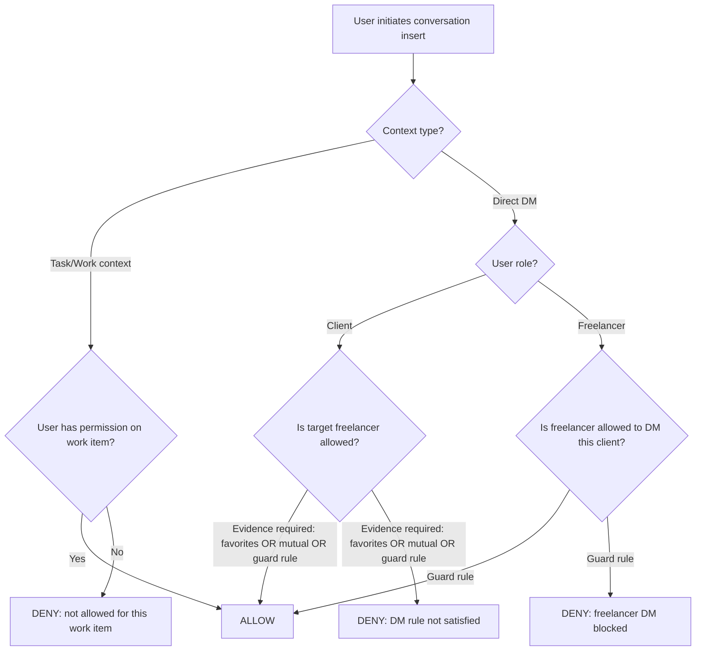

# Original Diagram (V1): Chat Creation Matrix

```mermaid
flowchart TD
    S[User initiates conversation insert] --> CTX{Context type?}

    CTX -- Task/Work context --> T1{User has permission on work item?}
    T1 -- Yes --> ALLOW[ALLOW]
    T1 -- No --> DENY1[DENY: not allowed for this work item]

    CTX -- Direct DM --> R1{User role?}
    R1 -- Client --> C1{Is target freelancer allowed?}
    C1 -->|Evidence required: favorites OR mutual OR guard rule| ALLOW
    C1 -->|Evidence required: favorites OR mutual OR guard rule| DENY2[DENY: DM rule not satisfied]

    R1 -- Freelancer --> F1{Is freelancer allowed to DM this client?}
    F1 -->|Guard rule| ALLOW
    F1 -->|Guard rule| DENY3[DENY: freelancer DM blocked]
```
