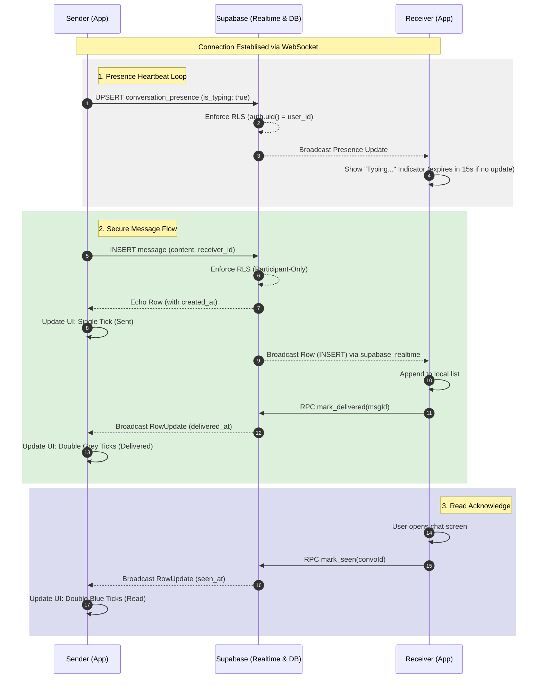

# Final Diagram: 08_chat-realtime-sync

```mermaid
sequenceDiagram
    autonumber
    participant A as Sender (App)
    participant S as Supabase (Realtime & DB)
    participant B as Receiver (App)

    Note over A,B: Connection Establised via WebSocket

    rect rgb(240, 240, 240)
    Note right of A: 1. Presence Heartbeat Loop
    A->>S: UPSERT conversation_presence (is_typing: true)
    S-->>S: Enforce RLS (auth.uid() = user_id)
    S-->>B: Broadcast Presence Update
    B->>B: Show "Typing..." Indicator (expires in 15s if no update)
    end

    rect rgb(220, 240, 220)
    Note right of A: 2. Secure Message Flow
    A->>S: INSERT message (content, receiver_id)
    S-->>S: Enforce RLS (Participant-Only)
    S-->>A: Echo Row (with created_at)
    A->>A: Update UI: Single Tick (Sent)

    S-->>B: Broadcast Row (INSERT) via supabase_realtime
    B->>B: Append to local list
    B->>S: RPC mark_delivered(msgId)
    S-->>A: Broadcast RowUpdate (delivered_at)
    A->>A: Update UI: Double Grey Ticks (Delivered)
    end

    rect rgb(220, 220, 240)
    Note right of B: 3. Read Acknowledge
    B->>B: User opens chat screen
    B->>S: RPC mark_seen(convoId)
    S-->>A: Broadcast RowUpdate (seen_at)
    A->>A: Update UI: Double Blue Ticks (Read)
    end
```
