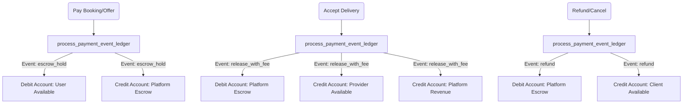

# Diagram V1 (Original)

```mermaid
flowchart TD
    Trigger(Pay Booking/Offer) --> RPC[process_payment_event_ledger]
    RPC -->|Event: escrow_hold| DR_Client[Debit Account: User Available]
    RPC -->|Event: escrow_hold| CR_Escrow[Credit Account: Platform Escrow]

    Trigger2(Accept Delivery) --> RPC2[process_payment_event_ledger]
    RPC2 -->|Event: release_with_fee| DR_Escrow[Debit Account: Platform Escrow]
    RPC2 -->|Event: release_with_fee| CR_Prov[Credit Account: Provider Available]
    RPC2 -->|Event: release_with_fee| CR_Fee[Credit Account: Platform Revenue]

    Trigger3(Refund/Cancel) --> RPC3[process_payment_event_ledger]
    RPC3 -->|Event: refund| DR_Escrow2[Debit Account: Platform Escrow]
    RPC3 -->|Event: refund| CR_Client2[Credit Account: Client Available]
```
