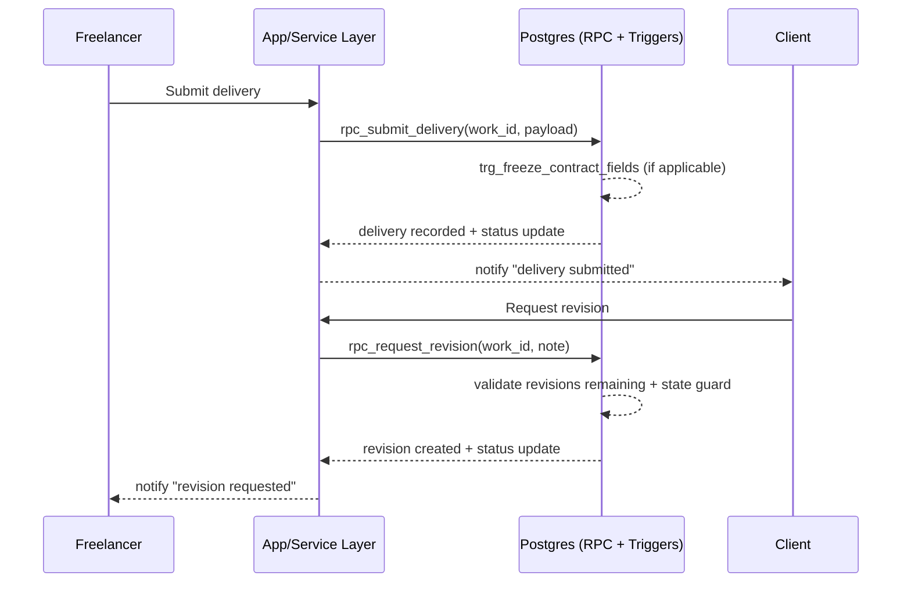

# Diagram V1 (Original)

```mermaid
sequenceDiagram
    participant F as Freelancer
    participant API as App/Service Layer
    participant DB as Postgres (RPC + Triggers)
    participant C as Client

    F->>API: Submit delivery
    API->>DB: rpc_submit_delivery(work_id, payload)
    DB-->>DB: trg_freeze_contract_fields (if applicable)
    DB-->>API: delivery recorded + status update
    API-->>C: notify "delivery submitted"

    C->>API: Request revision
    API->>DB: rpc_request_revision(work_id, note)
    DB-->>DB: validate revisions remaining + state guard
    DB-->>API: revision created + status update
    API-->>F: notify "revision requested"
```
