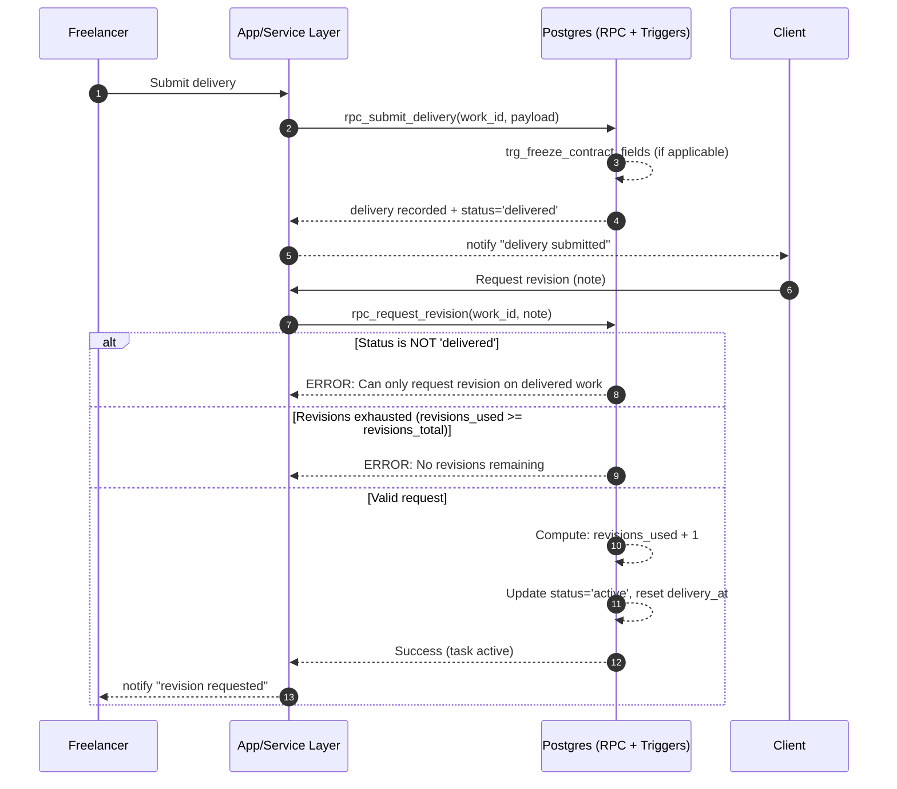

# Diagram Final (Improved)

```mermaid
sequenceDiagram
    autonumber
    participant F as Freelancer
    participant API as App/Service Layer
    participant DB as Postgres (RPC + Triggers)
    participant C as Client

    F->>API: Submit delivery
    API->>DB: rpc_submit_delivery(work_id, payload)
    DB-->>DB: trg_freeze_contract_fields (if applicable)
    DB-->>API: delivery recorded + status='delivered'
    API-->>C: notify "delivery submitted"

    C->>API: Request revision (note)
    API->>DB: rpc_request_revision(work_id, note)

    alt Status is NOT 'delivered'
        DB-->>API: ERROR: Can only request revision on delivered work
    else Revisions exhausted (revisions_used >= revisions_total)
        DB-->>API: ERROR: No revisions remaining
    else Valid request
        DB-->>DB: Compute: revisions_used + 1
        DB-->>DB: Update status='active', reset delivery_at
        DB-->>API: Success (task active)
        API-->>F: notify "revision requested"
    end
```
