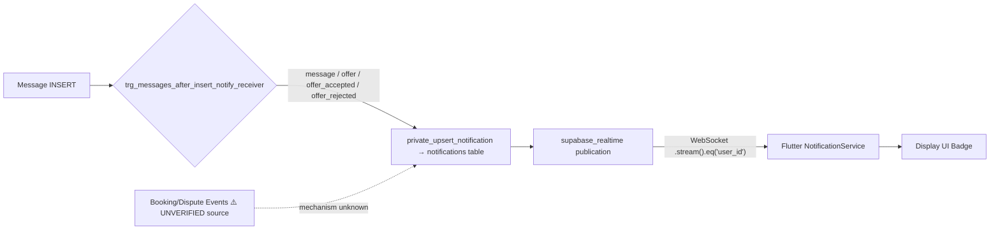

# 05_DIAGRAM_V1: Notification Routing

```mermaid
flowchart LR
    MSG[Message INSERT] --> TRG{trg_messages_after_insert_notify_receiver}
    TRG -->|"message / offer / offer_accepted / offer_rejected"| N[private_upsert_notification → notifications table]

    BOOKING["Booking/Dispute Events ⚠️ UNVERIFIED source"] -.->|"mechanism unknown"| N

    N --> RT[supabase_realtime publication]
    RT -->|"WebSocket .stream().eq('user_id')"| App[Flutter NotificationService]
    App --> Render[Display UI Badge]
```
