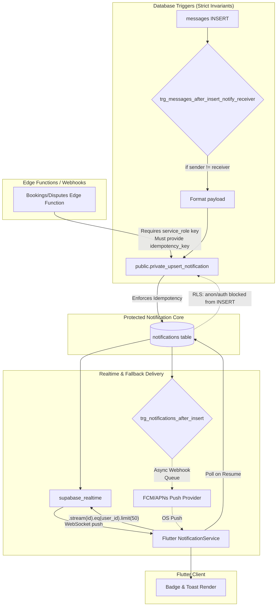

# 06_DIAGRAM_FINAL: Notification Routing

```mermaid
flowchart TD
    subgraph DB_Writes ["Database Triggers (Strict Invariants)"]
        MSG[messages INSERT] --> TRG{trg_messages_after_insert_notify_receiver}
        TRG -- "if sender != receiver" --> U_MSG[Format payload]
        U_MSG --> N_API
    end

    subgraph API_Writes ["Edge Functions / Webhooks"]
        BKG[Bookings/Disputes Edge Function]
        BKG -- "Requires service_role key\nMust provide idempotency_key" --> N_API
    end

    subgraph Internal_API ["Protected Notification Core"]
        N_API[public.private_upsert_notification]
        N_API -- "Enforces Idempotency" --> NOTIFS[(notifications table)]
        NOTIFS -. "RLS: anon/auth blocked from INSERT" .-> N_API
    end

    subgraph Delivery ["Realtime & Fallback Delivery"]
        NOTIFS --> RT[supabase_realtime]
        RT -- "WebSocket push" --> App[Flutter NotificationService]

        NOTIFS --> PushTRG{trg_notifications_after_insert}
        PushTRG -. "Async Webhook\nQueue" .-> FCM[FCM/APNs Push Provider]
        FCM -. "OS Push" .-> App
    end

    subgraph App_Layer ["Flutter Client"]
        App -- ".stream(id).eq(user_id).limit(50)" --> RT
        App -- "Poll on Resume" --> NOTIFS
        App --> UI[Badge & Toast Render]
    end
```
