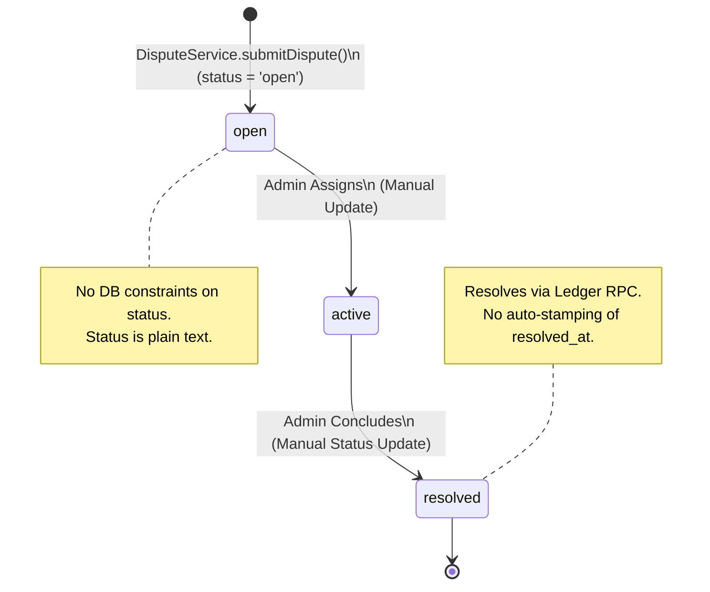

# Diagram V1: Current Dispute Lifecycle (Unhardened)

```mermaid
stateDiagram-v2
    [*] --> open: DisputeService.submitDispute()\n (status = 'open')

    open --> active: Admin Assigns\n (Manual Update)
    active --> resolved: Admin Concludes\n (Manual Status Update)

    resolved --> [*]

    note right of open
      No DB constraints on status.
      Status is plain text.
    end note

    note left of resolved
      Resolves via Ledger RPC.
      No auto-stamping of resolved_at.
    end note
```
