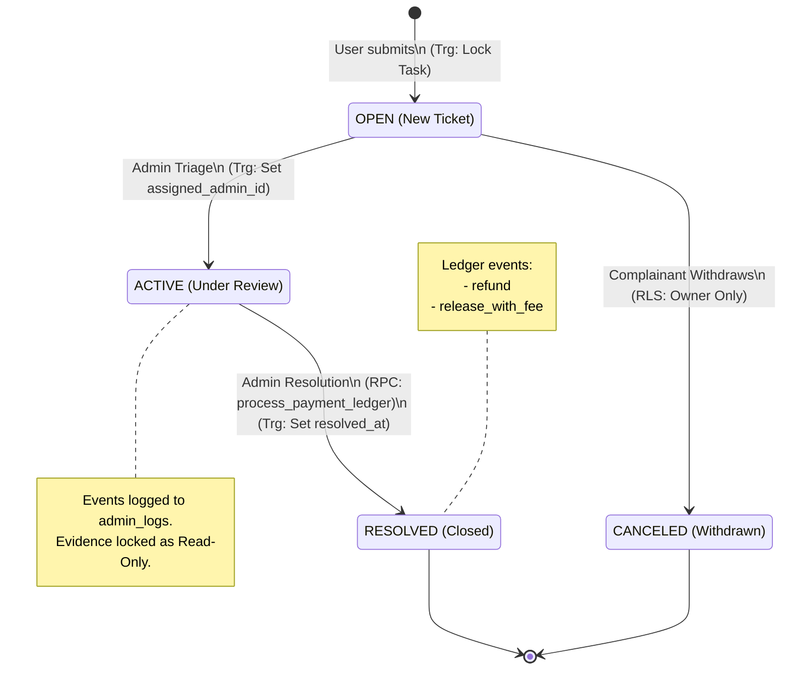

# Diagram Final: Production-Grade Dispute Lifecycle

```mermaid
stateDiagram-v2
    direction TB

    state "OPEN (New Ticket)" as open
    state "ACTIVE (Under Review)" as active
    state "RESOLVED (Closed)" as resolved
    state "CANCELED (Withdrawn)" as canceled

    [*] --> open: User submits\n (Trg: Lock Task)

    open --> active: Admin Triage\n (Trg: Set assigned_admin_id)
    open --> canceled: Complainant Withdraws\n (RLS: Owner Only)

    active --> resolved: Admin Resolution\n (RPC: process_payment_ledger)\n (Trg: Set resolved_at)

    resolved --> [*]
    canceled --> [*]

    note right of active
      Events logged to admin_logs.
      Evidence locked as Read-Only.
    end note

    note left of resolved
      Ledger events:
      - refund
      - release_with_fee
    end note
```
