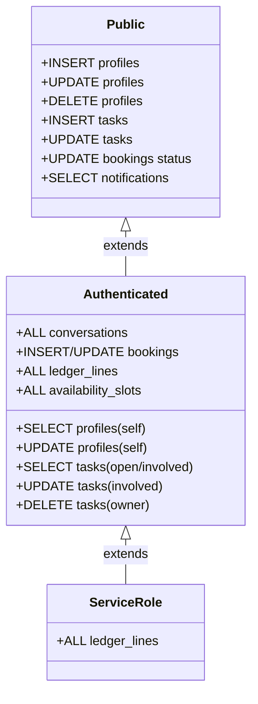

# 05_DIAGRAM_V1 (Current State)

```mermaid
classDiagram
    class Public {
        +INSERT profiles
        +UPDATE profiles
        +DELETE profiles
        +INSERT tasks
        +UPDATE tasks
        +UPDATE bookings status
        +SELECT notifications
    }
    class Authenticated {
        +SELECT profiles (self)
        +UPDATE profiles (self)
        +SELECT tasks (open/involved)
        +UPDATE tasks (involved)
        +DELETE tasks (owner)
        +ALL conversations
        +INSERT/UPDATE bookings
        +ALL ledger_lines
        +ALL availability_slots
    }
    class ServiceRole {
        +ALL ledger_lines
    }

    Public <|-- Authenticated : extends
    Authenticated <|-- ServiceRole : extends
```

_Note: This diagram reflects the commands/roles listed in the original file, showing a worrisome amount of "Public" write access and broad "ALL" permissions._
