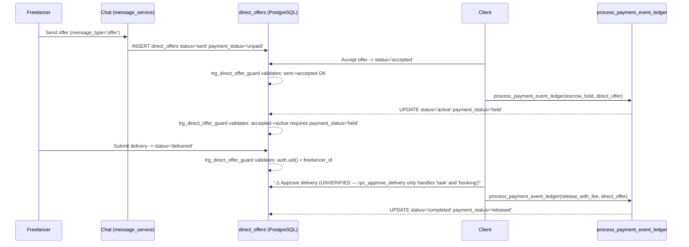

# Diagram V1 (Original)

```mermaid
sequenceDiagram
    participant F as Freelancer
    participant Chat as Chat (message_service)
    participant DO as direct_offers (PostgreSQL)
    participant C as Client
    participant Ledger as process_payment_event_ledger

    F->>Chat: Send offer (message_type='offer')
    Chat->>DO: INSERT direct_offers status='sent' payment_status='unpaid'

    C->>DO: Accept offer -> status='accepted'
    DO-->>DO: trg_direct_offer_guard validates: sent->accepted OK

    C->>Ledger: process_payment_event_ledger(escrow_hold, direct_offer)
    Ledger-->>DO: UPDATE status='active' payment_status='held'
    DO-->>DO: trg_direct_offer_guard validates: accepted->active requires payment_status='held'

    F->>DO: Submit delivery -> status='delivered'
    DO-->>DO: trg_direct_offer_guard validates: auth.uid() = freelancer_id

    C->>DO: "⚠️ Approve delivery (UNVERIFIED — rpc_approve_delivery only handles 'task' and 'booking')"
    C->>Ledger: process_payment_event_ledger(release_with_fee, direct_offer)
    Ledger-->>DO: UPDATE status='completed' payment_status='released'
```
