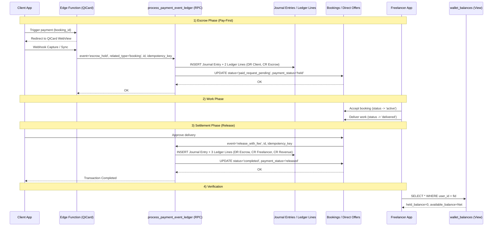

# FINAL DIAGRAM: Wallet & Escrow (Ledger V2)

```mermaid
sequenceDiagram
    participant C as Client App
    participant Edge as Edge Function (QiCard)
    participant Ledger as process_payment_event_ledger (RPC)
    participant J as Journal Entries / Ledger Lines
    participant B as Bookings / Direct Offers
    participant F as Freelancer App
    participant W as wallet_balances (View)

    note over C, F: 1) Escrow Phase (Pay-First)
    C->>Edge: Trigger payment (booking_id)
    Edge-->>C: Redirect to QiCard WebView
    C->>Edge: Webhook Capture / Sync
    Edge->>Ledger: event='escrow_hold', related_type='booking', id, idempotency_key
    Ledger->>J: INSERT Journal Entry + 2 Ledger Lines (DR Client, CR Escrow)
    Ledger->>B: UPDATE status='paid_request_pending', payment_status='held'
    B-->>Ledger: OK
    Ledger-->>Edge: OK

    note over C, F: 2) Work Phase
    F->>B: Accept booking (status -> 'active')
    F->>B: Deliver work (status -> 'delivered')

    note over C, F: 3) Settlement Phase (Release)
    C->>B: Approve delivery
    B->>Ledger: event='release_with_fee', id, idempotency_key
    Ledger->>J: INSERT Journal Entry + 3 Ledger Lines (DR Escrow, CR Freelancer, CR Revenue)
    Ledger->>B: UPDATE status='completed', payment_status='released'
    B-->>Ledger: OK
    Ledger-->>C: Transaction Completed

    note over C, F: 4) Verification
    F->>W: SELECT * WHERE user_id = fid
    W-->>F: held_balance=0, available_balance=Net
```
