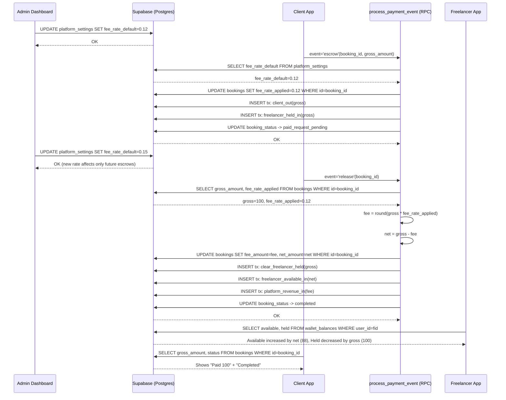

# Original Diagram (V1)

_Extracted from Sline_everything/AppDigram/All_Diagrams/22_Dynamic_Platform_Fee.md_

```mermaid
sequenceDiagram
    participant Admin as Admin Dashboard
    participant DB as Supabase (Postgres)
    participant C as Client App
    participant RPC as process_payment_event (RPC)
    participant F as Freelancer App

    %% Admin sets global fee rate (can change anytime)
    Admin->>DB: UPDATE platform_settings SET fee_rate_default=0.12
    DB-->>Admin: OK

    %% Client pays -> escrow (LOCK fee rate now)
    C->>RPC: event='escrow'(booking_id, gross_amount)
    RPC->>DB: SELECT fee_rate_default FROM platform_settings
    DB-->>RPC: fee_rate_default=0.12

    RPC->>DB: UPDATE bookings SET fee_rate_applied=0.12 WHERE id=booking_id
    RPC->>DB: INSERT tx: client_out(gross)
    RPC->>DB: INSERT tx: freelancer_held_in(gross)
    RPC->>DB: UPDATE booking_status -> paid_request_pending
    DB-->>RPC: OK

    %% Later: Admin changes global fee rate
    Admin->>DB: UPDATE platform_settings SET fee_rate_default=0.15
    DB-->>Admin: OK (new rate affects only future escrows)

    %% Client approves -> release uses LOCKED fee (0.12)
    C->>RPC: event='release'(booking_id)
    RPC->>DB: SELECT gross_amount, fee_rate_applied FROM bookings WHERE id=booking_id
    DB-->>RPC: gross=100, fee_rate_applied=0.12

    RPC->>RPC: fee = round(gross * fee_rate_applied)
    RPC->>RPC: net = gross - fee

    RPC->>DB: UPDATE bookings SET fee_amount=fee, net_amount=net WHERE id=booking_id
    RPC->>DB: INSERT tx: clear_freelancer_held(gross)
    RPC->>DB: INSERT tx: freelancer_available_in(net)
    RPC->>DB: INSERT tx: platform_revenue_in(fee)
    RPC->>DB: UPDATE booking_status -> completed
    DB-->>RPC: OK

    %% Final values visible to each party
    F->>DB: SELECT available, held FROM wallet_balances WHERE user_id=fid
    DB-->>F: Available increased by net (88), Held decreased by gross (100)

    C->>DB: SELECT gross_amount, status FROM bookings WHERE id=booking_id
    DB-->>C: Shows "Paid 100" + "Completed"
```
