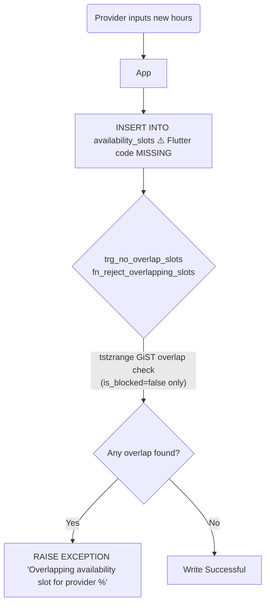

# Original Diagram V1

```mermaid
flowchart TD
    Provider(Provider inputs new hours) --> App
    App --> INSERT["INSERT INTO availability_slots ⚠️ Flutter code MISSING"]
    INSERT --> Guard{trg_no_overlap_slots\nfn_reject_overlapping_slots}

    Guard -- "tstzrange GiST overlap check\n(is_blocked=false only)" --> Collision{Any overlap found?}
    Collision -- Yes --> Reject["RAISE EXCEPTION 'Overlapping availability slot for provider %'"]
    Collision -- No --> Allow[Write Successful]
```
