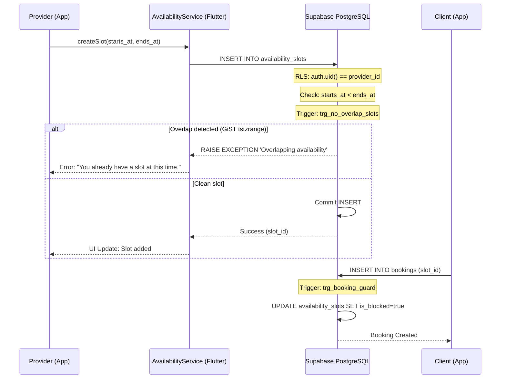

# Final Redesigned Sequence Diagram

```mermaid
sequenceDiagram
    participant P as Provider (App)
    participant S as AvailabilityService (Flutter)
    participant DB as Supabase PostgreSQL
    participant C as Client (App)

    %% Provider creates an availability slot
    P->>S: createSlot(starts_at, ends_at)
    S->>DB: INSERT INTO availability_slots

    Note over DB: RLS: auth.uid() == provider_id
    Note over DB: Check: starts_at < ends_at
    Note over DB: Trigger: trg_no_overlap_slots

    alt Overlap detected (GiST tstzrange)
        DB-->>S: RAISE EXCEPTION 'Overlapping availability'
        S-->>P: Error: "You already have a slot at this time."
    else Clean slot
        DB->>DB: Commit INSERT
        DB-->>S: Success (slot_id)
        S-->>P: UI Update: Slot added
    end

    %% Client later books the slot
    C->>DB: INSERT INTO bookings (slot_id)
    Note over DB: Trigger: trg_booking_guard
    DB->>DB: UPDATE availability_slots SET is_blocked=true
    DB-->>C: Booking Created
```
